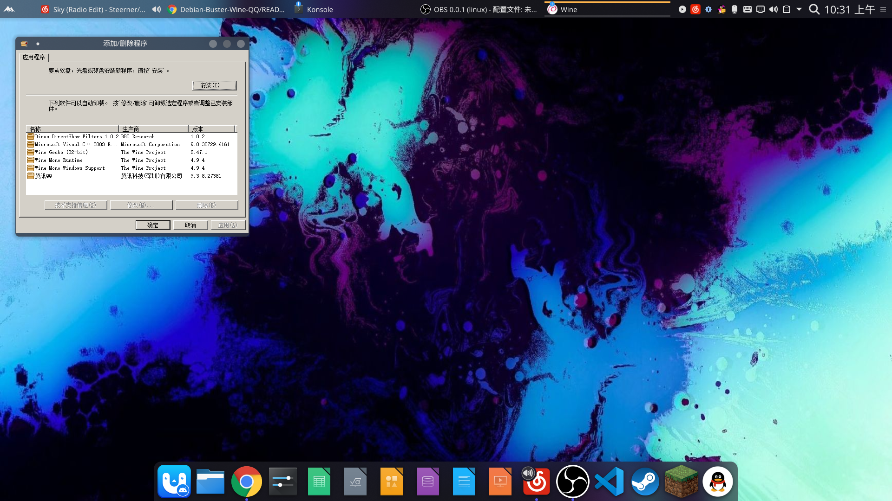

# #Linux-Wine-Configuration（Debian-Buster-Wine-QQ）  
### Q&A: 这篇MarkDown文档有什么用?  
本篇文档为Debian(10-Buster)及其衍生发行版提供了一套稳定可用的Wine配置方案用于替换在[Depian-Project](https://github.com/ShulkerWalker/Depian-Project) 中某些应用环境中无法使用fcitx在远程X11程序中进行输入的Bug(已知为Fcitx方面的Bug)。  
## 一,处理FAudio部分依赖  
### 1.导入FAudio钥匙  
下载本Repo中的Release.key并用下面的指令导入:  
`$ sudo apt-key add Release.key`  
### 2.添加Opensuse的Wine官方源到apt中  
`$ sudo echo "deb https://download.opensuse.org/repositories/Emulators:/Wine:/Debian/Debian_10 ./" >> /etc/apt/sources.list`  
### 3.更新源列表  
`$ sudo apt update`  
## 二,安装官方Winehq  
### 1.系统中添加i386(x32)架构支持  
`$ sudo dpkg --add-architecture i386`   
### 2.导入Winehq的钥匙并添加  
`$ wget -nc https://dl.winehq.org/wine-builds/winehq.key`  
`$ sudo apt-key add winehq.key`  
### 3.添加Winehq源  
`$ sudo echo "deb https://dl.winehq.org/wine-builds/debian/ buster main" >> /etc/apt/sources.list`  
### 4.更新源  
`$ sudo apt update`  
### 5.安装Wine  
`$ sudo apt install --install-recommends winehq-stable`  
*Tag:注意上面FAudio的处理和Winehq的处理顺序不能打乱*  
*PS:卸载wine则要使用下面的指令*  
`$ sudo apt --purge autoremove --install-recommends winehq-stable`  
## 三,启动Wine初始化配置    
### 1.初始化Wine  
`$ winecfg`  
依次按提示安装mono,gecko，安装时间根据网络环境而定（百兆电信不挂代理实测超过1H），然后出现Configuration界面，点OK即可。  
### 2.适配Wine字体  
Wine本身调用Linux操作系统的字体，若您之前复制了Windows系统的字体到`/usr/share/fonts/`中的话，这部分一般没有问题，但这还不够，您还需要配置Wine中模拟的Windows字体，这部分字体在`~/.wine/drive_c/windows/Fonts/`中,您需要再将Windows字体复制到该路径下一次并为了处理部分中文乱码使用下面的方案配置注册表。  
#### 创建注册表修改文件  
`$ touch font.reg`  
#### 将下列内容填入注册表修改文件中  
```
    REGEDIT4
    [HKEY_LOCAL_MACHINE\Software\Microsoft\Windows NT\CurrentVersion\FontSubstitutes]
    "Arial"="simsun"
    "Arial CE,238"="simsun"
    "Arial CYR,204"="simsun"
    "Arial Greek,161"="simsun"
    "Arial TUR,162"="simsun"
    "Courier New"="simsun"
    "Courier New CE,238"="simsun"
    "Courier New CYR,204"="simsun"
    "Courier New Greek,161"="simsun"
    "Courier New TUR,162"="simsun"
    "FixedSys"="simsun"
    "Helv"="simsun"
    "Helvetica"="simsun"
    "MS Sans Serif"="simsun"
    "MS Shell Dlg"="simsun"
    "MS Shell Dlg 2"="simsun"
    "System"="simsun"
    "Tahoma"="simsun"
    "Times"="simsun"
    "Times New Roman CE,238"="simsun"
    "Times New Roman CYR,204"="simsun"
    "Times New Roman Greek,161"="simsun"
    "Times New Roman TUR,162"="simsun"
    "Tms Rmn"="simsun"
```  
#### 向Wine中导入注册表配置  
`wine regedit font.reg`  
或简单一点  
`regedit font.reg`  
### 1.安装exe软件(以QQ为示例)  
`wine uninstaller`  
会弹出如下窗口  
  
点击界面中的Install便可以浏览本地文件并进行安装,如果您在浏览本地文件的界面中找不到自己的exe文件可下拉菜单选择全部文件格式。  
## 四,修复QQ,Tim,WeChat等输入框无法输入问题    
安装`winetricks`来对Wine进行函数库修复  
`$ sudo apt install winetricks`  
使用`winetricks`修复Wine函数库riched20  
`$ sudo winetricks riched20`  
这个过程要下载两个文件`W2KSP4_EN.EXE`与`InstMsiW.exe`，很难下载，中断了失败不要紧，可以不断执行`winetricks riched20`，直到网络能够连上解决的话下载成功就OK。
安装好`riched20`函数库后建议您重新安装QQ,Tim,WeChat等软件,并手动添加函数库到Wine中。  
添加函数库:  
`$ winecfg`  
弹出图形界面,点击`增加程序设置`选择自己安装好的软件的exe文件,在`winecfg`的图形界面中选中高亮自己刚刚增加的程序,Windows兼容版本选用Windows7,点击上方函数库,点击新增函数库顶替旁的下拉菜单,输入`riched20`点击添加,输入`riched32`点击添加,输入`msvcp60`点击添加,最后在界面右下角点击`应用`并`确认`。  
至此,您已经可以愉快的在您的Debian及其衍生发行版上使用Wine-QQ了  
## 五,解决不支持IPV6的网络环境下QQ无法接收头像,图片,视频等资源的问题  
### 1.关闭IPV6
#### 编辑配置文件  
`$ sudo vim /etc/sysctl.conf`(您也可以使用您自己喜欢的编辑器)  
在文件末尾加入  
```
# IPv6 disabled
net.ipv6.conf.all.disable_ipv6 =1
net.ipv6.conf.default.disable_ipv6 =1
net.ipv6.conf.lo.disable_ipv6 =1
```  
保存并退出  
#### 执行  
`sudo sysctl -p`  
这样您的QQ就可以获取到文件资源了  
### 2.添加自动脚本防止系统重启后配置失效  
#### 创建文件  
`$ sudo touch /etc/rc.local`  
#### 填入以下内容并保存  
```
#!/bin/bash

# /etc/rc.local

/etc/sysctl.d

/etc/init.d/procps restart

exit 0
```  
#### 附权限  
`$ sudo chmod 755 /etc/rc.local`  
至此您已经完成了所有配置,尽情享受吧w  
## 六,特别鸣谢  
[CSDN-Debian10安装wine及用wine安装微信、QQ与TIM](https://blog.csdn.net/pabcsxyz/article/details/108132593)  

[CSDN-ubuntu下解决deepin-wine-qq无法加载图片的问题](https://blog.csdn.net/weixin_44823747/article/details/105559615)  

<!--Project-By-ShulkerSakura-->
